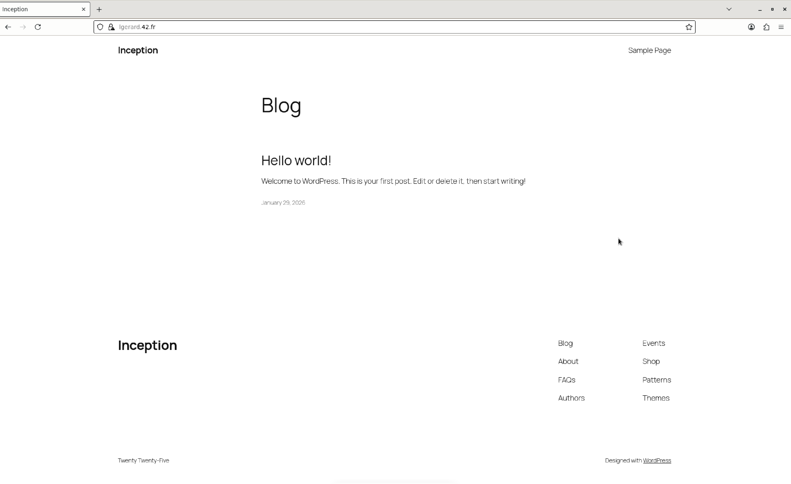
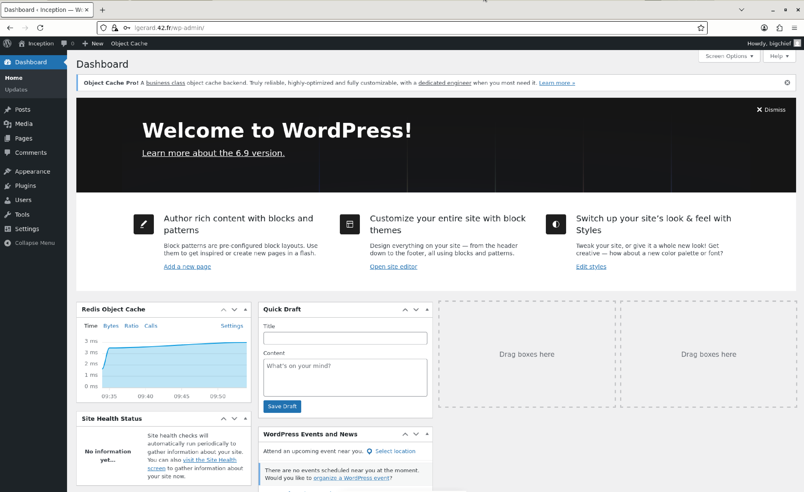
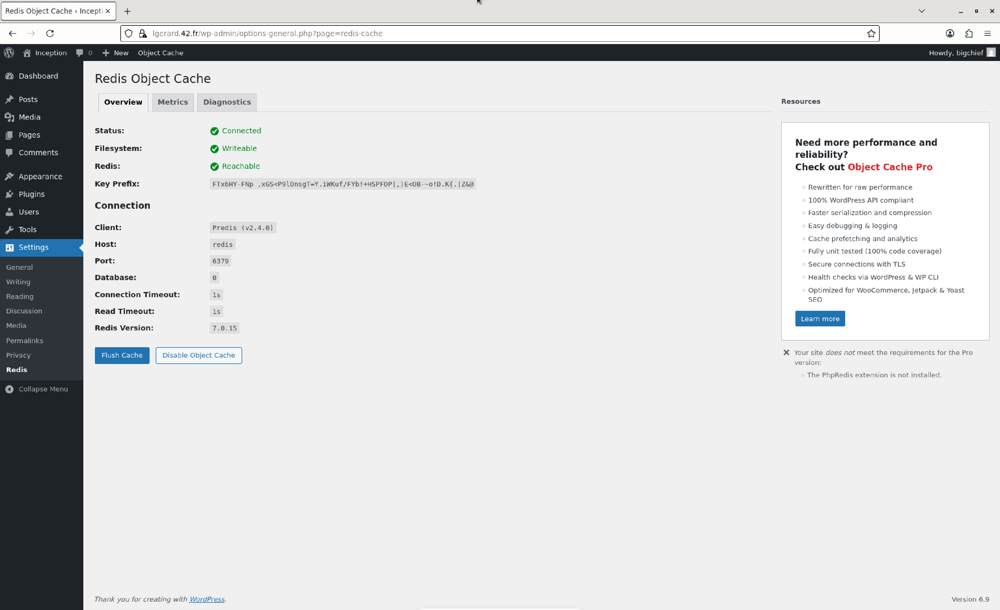
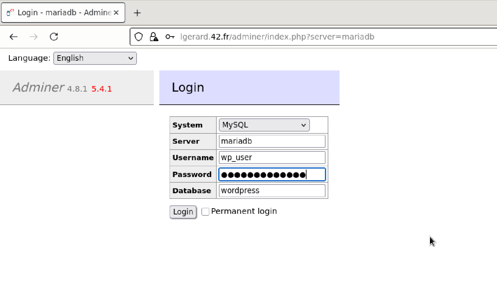
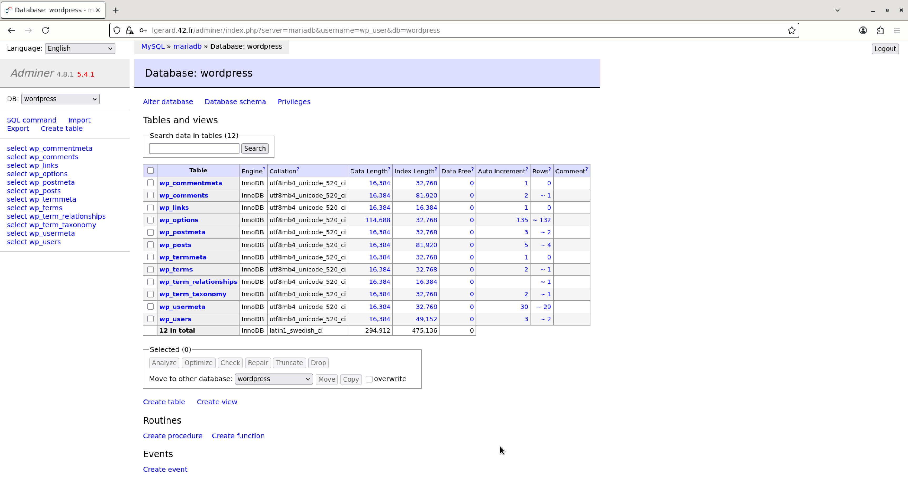
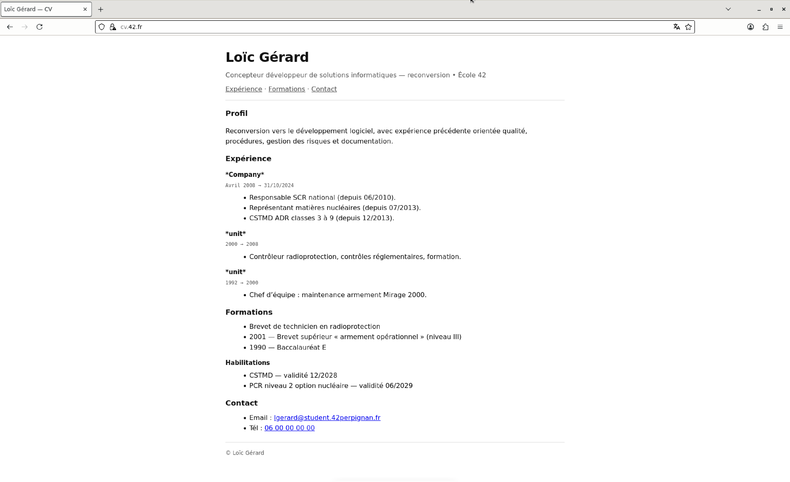
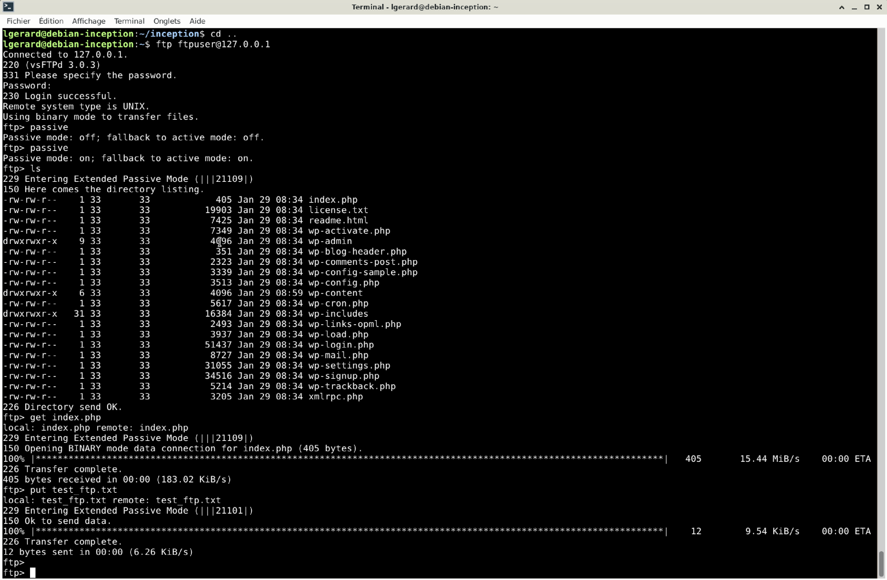
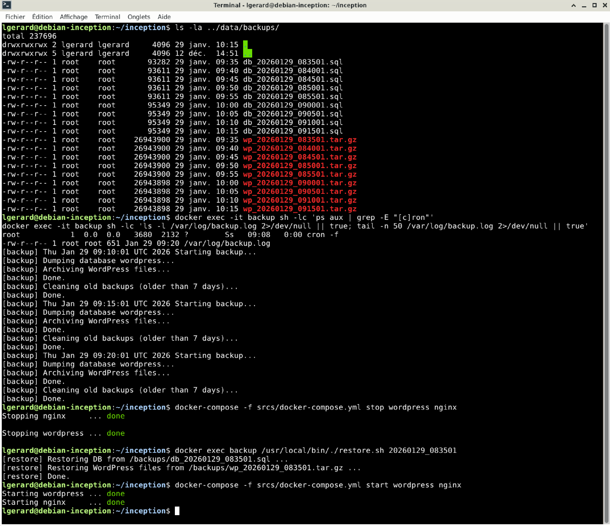

<div align="center">
  <h2>Inception – 42 project</h2>
  
  <br>
</div>


> **Inception** is a **DevOps-oriented project** focused on building a complete web infrastructure using **Docker** and **Docker Compose**, following strict security and configuration rules.

---

## 📖 Table of Contents
- [Description](#-description)
- [Architecture](#-architecture)
- [Features](#-features)
- [Bonus](#-bonus)
- [Installation](#-installation)
- [Usage](#-usage)
- [Project Structure](#-project-structure)
- [Examples](#-examples)
- [Roadmap](#-roadmap)
- [Credits](#-credits)
- [License](#-license)

---

## 📝 Description
This project introduces the fundamentals of **containerization and orchestration**.  
The goal is to deploy a fully functional and secure **WordPress stack** using:

- Docker
- Docker Compose
- NGINX (TLS)
- WordPress + PHP-FPM
- MariaDB

Each service runs in its **own container**, built from scratch using custom Dockerfiles.

---

## 🏗 Architecture
Mandatory infrastructure:
- **NGINX** container with TLS 1.2 / 1.3
- **WordPress** container with PHP-FPM
- **MariaDB** container for database management
- Dedicated Docker volumes for persistence
- Isolated Docker network

Bonus services (optional containers):
- **Redis** cache for WordPress
- **FTP** server pointing to the WordPress volume
- **Adminer** for database administration
- **Static Website** (non-PHP) served by its own container
- **Backup** service with cron-based scheduled tasks

---

## ✨ Features
- ✅ Dockerfiles written from scratch (no pre-built images).
- ✅ Secure NGINX configuration with SSL.
- ✅ WordPress fully configured via environment variables.
- ✅ MariaDB initialized automatically.
- ✅ Persistent volumes for database and website data.
- ✅ Clean container orchestration using Docker Compose.

---

## ⭐ Bonus
The official bonus list for the Inception subject includes:

- ✅ **Redis cache** for WordPress in order to properly manage caching.
- ✅ **FTP server container** pointing to the WordPress volume (uploads/themes/plugins).
- ✅ **Static website container** (any language **except PHP**) — e.g. a showcase site / resume.
- ✅ **Adminer** container for database administration.

### ➕ Extra bonus (project-specific)
In addition, this repository also includes a **scheduled backup service**:

- ⏱ **Regular backups** executed with `cron`
- 🗄 **MariaDB database dumps**
- 📁 **WordPress content backup** (typically the `wp-content` directory)
- 💾 Backups stored in a dedicated volume
- 🔄 Fully automated, no manual intervention required

This service runs in its own container and improves **durability and recovery** in case of failure.

---

## ⚙️ Installation
Requirements:
- Linux
- Docker
- Docker Compose

Clone the repository:
```bash
git clone https://github.com/LogUmi/inception.git
cd inception
```

Build and start the infrastructure:
```bash
make
```

---

## 🖥 Usage
Once running, access the services according to your configuration (domain / hosts file / ports).  
Typical access examples:

- WordPress (NGINX + TLS): `https://<your-domain>`
- Adminer: `https://<your-domain>/adminer` *(if configured this way)*
- Static website: `https://<your-domain>/` or a dedicated subdomain *(depending on your setup)*
- FTP: connect with any FTP client to the configured port *(bonus)*

Stop the stack:
```bash
make down
```

Remove everything (containers, volumes, images):
```bash
make fclean
```

For more information please read additional documents: README42.md, USER_DOC.md and DEV_DOC.md.

---

## 📂 Project Structure
```
inception/
 ├─ en.subject.pdf
 ├── LICENSE
 ├─ Makefile
 ├─ README.md
 ├─ README42.md
 ├─ USER_DOC.md
 ├─ DEV_DOC.md
 ├─ secrets/
 │    ├─ credential.txt
 │    ├─ ftp_password.txt
 │    ├─ mysql_root_password.txt
 │    ├─ mysql_user_password.txt
 │    ├─ wp_admin_password.txt
 │    └─ wp_user_password.txt
 └─ srcs/
	 ├─ .env
	 ├─ docker-compose.yml
	 └─ requirements/
    	 ├─ bonus/
    	 │   ├─ adminer
    	 │	 │    └─ Dockerfile
    	 │   ├─ backup
    	 │   │   ├─ Dockerfile
    	 │   │   └─ tools/
    	 │   │       ├─ backup.sh
    	 │   │       ├─ backup-cron
    	 │   │       ├─ entrypoint.sh
    	 │   │       └─ restore.sh
    	 │   ├─ cv
    	 │   │   ├─ Dockerfile
    	 │   │   │   ├─ conf/
    	 │   │   │    └─ default.conf
    	 │   │   └─ site/
    	 │   │       ├─ index.html
    	 │   │       └─ assets/
    	 │   │           ├─ app.js
    	 │   │           └─ style.css
    	 │   ├─ ftp
    	 │   │   ├─ Dockerfile
    	 │   │   ├─ conf/
    	 │   │   |   └─ vsftpd.cnf
    	 │   │   └─ tools/
    	 │   │       └─ entrypoint.sh
    	 │   └─ redis
    	 │       └─ Dockerfile
    	 ├─ mariadb/
    	 │   ├─ Dockerfile
    	 │   ├─ conf/
    	 │   │   └─ 50-server.cnf
    	 │   └─ tools/
    	 │       └─ entrypoint.sh
    	 ├─ nginx/
    	 │   ├─ Dockerfile
    	 │   ├─ conf/
    	 │   │   └─ nginx.conf
    	 │   └─ tools/
    	 │       └─ entrypoint.sh
    	 └─ wordpress/
        	 ├─ Dockerfile
        	 └─ tools/
            	 └─ entrypoint.sh
```

---

## 🔎 Examples

Wordpress:

<br>

<br><br>

Redis:

<br><br>

Adminer:

<br>

<br><br>

Static page:

<br><br>

Ftp:

<br><br>

Backup:

<br>

---

## 🚀 Roadmap
This repository reflects the final state of the project as evaluated at 42, including bonus features.

---

## 👤 Credits
Project developed by:
- **Loïc Gérard** – 📧 lgerard@student.42perpignan.fr  
  [École 42 Perpignan](https://42perpignan.fr)

---

## 📜 License
This project is released under the MIT License.
Third-party services used (Docker, WordPress, NGINX, MariaDB, Redis, Adminer)
remain under their respective licenses.

> ⚠️ **Note for students**  
> If you are a student at 42 (or elsewhere), it is strongly recommended **not to copy/paste** this code.  
> Instead, try to **write your own solution** — it’s the only way to really learn and succeed.
